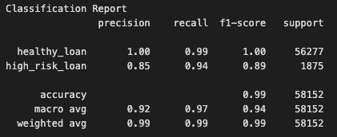
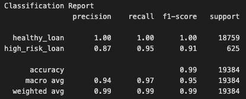

# Credit Risk Analysis Report
## Overview of the Analysis
The objective of this analyis is to use machine learning to predict loan risk, if a loan is healthy (0) or high-risk (1) based on financial features to be able to assess loan risk and minimize defaults. Historical lending data of 77,536 lendors is used that contains the following categories:
 
#### 7 Features
- loan_size: loan amount requested 
- interest_rate: interest rate on the loan
- borrower_income: annual income of borrower
- debt_to_income: debt to income ratio
- num_of_accounts: number of open accounts
- derogatory_marks: number of negative entries on borrowers credit report 
- total_debt: total debt of borrower
#### 1 Target Value
- loan_status: risk of loan (healthy (0) or high-risk (1))

### Stages of the analysis
- Preprocess Data
    - The csv file was read into a Pandas DataFrame
    - The target variable `loan status` was separated from the features
    - The dataset was split into training, set at 75% and testing at 25% using `train_test_split`
- Train Data
    - `LogisticRegression` is used to train the data `X_train` and `y_train`
- Evaluate Model Performance
    - Predications are made on training and testing data
    - Performace is evaluated using accuracy score, precision, recall, F1-score and the confusion matrix

## Results

- Logistics Regression Model Performance
    - Training Accuracy: 99.27%
    - Testing Accuracy: 99.39% 
### Train
- Confusion Matrix Train  

- Classificion Report Train  

### Test
- Confusion Matrix Test  

- Classificion Report Test  

## Summary

The Logistic Regression model performed with a high accuracy of 99.39%. In the classification report, recall at 95% suggests that most high-risk loans are classified correctly. The confusion matrix shows a false negaitve of 32 high risk loans classified incorrectly as healthy, reducing financial risk. 

Would I recommend this model for use by the company? Yes. 
This model provides high accuracy, precision and recall and the low false negative ensures that high-risk loans are not wrongly classified, negatively impacting a financial institution. 